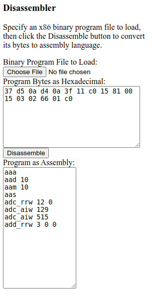

Disassembler
============

An assembly code dissassembler implemented in JavaScript.  To see it in action, open the file Source/Disassembler.html in a web browser that runs JavaScript.

As of this writing, this program is a work in progress.

